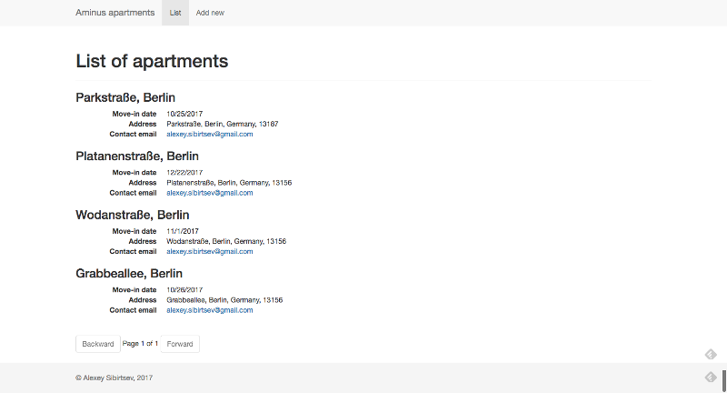
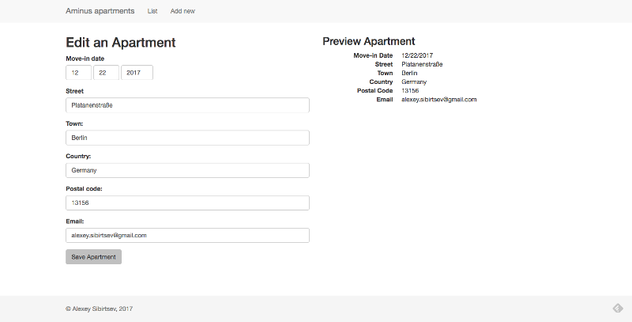

Animus Apartments
======

# Motivation
This project was built for animus.de

# Requirements
* *nix operation system (e.g. Ubuntu Linux, Mac OS)
* `node.js`
* `npm`

## Build Setup

``` bash
# install dependencies
npm install

# serve with hot reload at localhost:8080
npm run dev
```

# Screenshots
## List page


## Edit page
